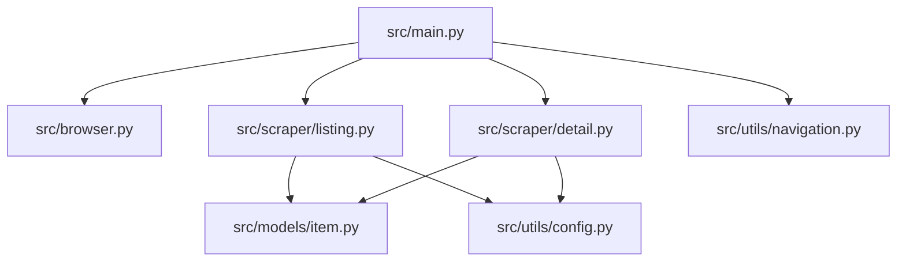

# Scraper Source Code Deep Dive

This directory contains the modernized, production-grade implementation of the Playwright scraper. It is designed to be **modular**, **scalable**, and **robust**.

## Quick Start

Run the main orchestrator from the project root:

```bash
PYTHONPATH=. uv run python src/main.py
```

## Architecture Overview

The project is structured to separate concern between browser management, data extraction, and data validation.



### Core Components

- **`main.py` (The Brain)**: Manages the high-level workflow. It follows a "Discovery -> Enumeration" pass for each page, ensuring that we never lose our place in the crawl.
- **`browser.py` (The Driver)**: Encapsulates Playwright initialization. It includes a global **Request Interceptor** that blocks images, fonts, and media to save bandwidth and improve performance.
- **`scraper/` (The Parsers)**: 
    - `listing.py`: Extracts titles, prices, and URLs from the gallery pages. It uses `urllib.parse.urljoin` to resolve absolute links reliably.
    - `detail.py`: Extracts deep metadata (UPC, descriptions, taxes) from individual book pages.
- **`models/` (The Validator)**: Uses **Pydantic** (`BookItem`) to enforce a strict schema on scraped data. This prevents "dirty data" from entering your final output.
- **`utils/` (The Helpers)**:
    - `config.py`: Centralized CSS selectors. If the website changes its layout, you only need to update this one file.
    - `navigation.py`: Logic for finding the "Next" button and handling page transitions.

## Key Engineering Principles

### 1. Two-Pass Crawling
Instead of "Scrape -> Click -> Back" for every item, we:
1.  **Discover**: Fetch all 20 book links from the listing page in one go.
2.  **Enumerate**: Iterate through that static list of links.
This prevents "stale element" errors that happen when the listing page refreshes or changes state while you are elsewhere.

### 2. Robust URL Resolution
We never assume a link is absolute. By using `urljoin(page.url, href)`, we handle the site's complex relative path structure (which changes depending on whether you are at the root or in a sub-directory).

### 3. Graceful Failure
The `detail.py` parser uses a `get_text` helper that wraps every extraction in a `try/except` block with a timeout. If one book is missing a description, the scraper simply marks it as "N/A" and continues instead of crashing the entire session.
